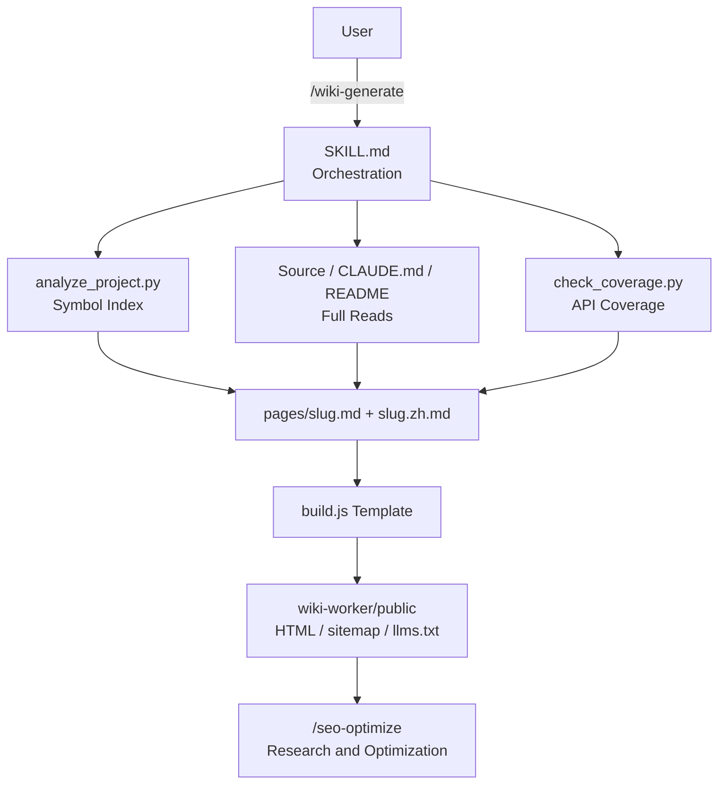

> [!NOTE]
> This README was generated by [SKILL](https://github.com/agenvoy/skill-readme-generate), get the ZH version from [here](./doc/README.zh.md). 
> This skill's implementation was fully agent-generated; the developer only tuned its input/output.

***

<strong>BILINGUAL DOCS SITES AUTO-GENERATED FROM YOUR SOURCE!</strong>

***

> An agent skill with bilingual docs site generation, API coverage tracking, and GitHub release history

## Table of Contents

- [Features](#features)
- [Architecture](#architecture)
- [License](#license)

## Features

> `/wiki-generate` · [Documentation](./doc/doc.md)

- **Deployable Bilingual Docs Site** — Each topic becomes an English and Chinese markdown pair that the bundled `build.js` compiles into static HTML with sidebar, TOC, and sitemap, ready for Cloudflare Workers.
- **Paired with /seo-optimize** — The template emits JSON-LD, hreflang, llms.txt, and other SEO outputs, while research and optimization go to `/seo-optimize`; if it is missing, the skill offers to download it and otherwise falls back to basic rules.
- **API Coverage and Removal Records** — `check_coverage.py` finds public symbols the docs never mention and walks tags to mark the version each removed symbol disappeared in.
- **Full-File Reads Before Writing** — The analyzer only indexes which files to read; every page requires reading its source and `CLAUDE.md` in full, so docs capture branches and edge cases rather than bare signatures.
- **README Home and Release History** — The home page mirrors the project README verbatim and version history syncs straight from GitHub Releases, so neither is written by hand.

## Architecture

> [Full Architecture](./doc/architecture.md)

## License

This project is licensed under the [MIT LICENSE](LICENSE).
