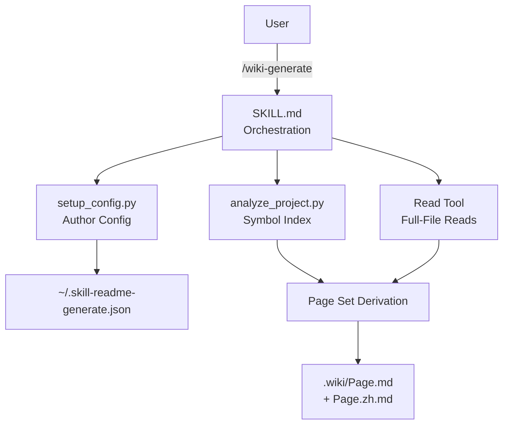

> [!NOTE]
> This README was generated by [SKILL](https://github.com/pardnchiu/skill-readme-generate).

***

  <strong>BILINGUAL GITHUB WIKIS AUTO-GENERATED FROM YOUR SOURCE!</strong>

***

> A Claude Code skill that derives multi-page bilingual GitHub wikis from CLAUDE.md, with full-file reads, selective page regeneration, and shared author config

## Table of Contents

- [Features](#features)
- [Built With](#built-with)
- [Architecture](#architecture)
- [License](#license)

## Features

> Install to `~/.claude/skills/wiki-generate/` · [SKILL.md](./SKILL.md)

- **Bilingual Paired Pages** — Every topic outputs `Page.md` + `Page.zh.md` with aligned section structure, identical tables, and untranslated identifiers so function and env-var names stay grep-friendly across languages.
- **Page Set Derived from CLAUDE.md** — 6–12 pages auto-derived from CLAUDE.md headings and project signals; covers Home, Getting-Started, Core-Concepts, Architecture, Configuration, CLI/API Reference, plus subsystem pages such as MCP-Integration or Skill-System.
- **Full-File Read Contract** — `analyze_project.py` JSON is treated as a symbol index only; each page enforces complete reads of entry points, dispatch loops, env handlers and CLAUDE.md so wikis capture branches and edge cases instead of just signatures.
- **Selective Regeneration** — `--only home,configuration` refreshes specific pages without reading or overwriting others; `--pages` overrides the auto-derived set for first-run customization.
- **Shared Author Config** — Reuses `~/.skill-readme-generate.json` from readme-generate so author name, email, URL, and GitHub owner are configured once across both skills.

## Built With

## Architecture

## License

This project is licensed under the [MIT LICENSE](LICENSE).
