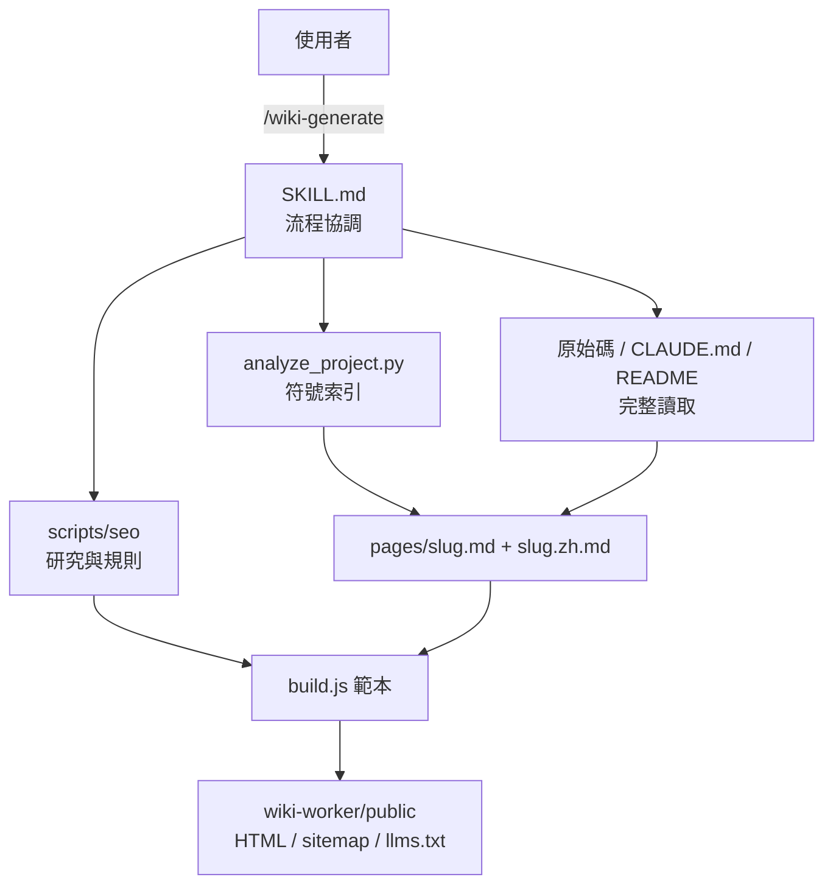

> [!NOTE]
> 此 README 由 [SKILL](https://github.com/agenvoy/skill-readme-generate) 生成，英文版請參閱 [這裡](../README.md)。 
> 此 skill 的實作內容全由 agent 生成，開發者僅針對 input / output 進行調整。

***

<strong>BILINGUAL DOCS SITES AUTO-GENERATED FROM YOUR SOURCE!</strong>

***

> Agent Skill，具備雙語靜態文件站、內建 SEO／AEO 優化與 GitHub 版本紀錄

## 目錄

- [功能特點](#功能特點)
- [架構](#架構)
- [授權](#授權)

## 功能特點

> `/wiki-generate` · [完整文件](./doc.zh.md)

- **可部署的雙語文件站** — 每個主題產出英中成對 markdown，由隨附的 `build.js` 編譯為含側欄、目錄與 sitemap 的靜態 HTML，可直接部署到 Cloudflare Workers。
- **SEO／AEO 內建於每次生成** — 先依研究協定查證當下做法，再產出 title、description、JSON-LD 實體圖、hreflang 與 llms.txt，最後逐頁驗證並寫出報告。
- **完整讀檔才下筆** — analyzer 只當作「該讀哪些檔」的索引，每頁都要讀完對應原始碼與 `CLAUDE.md`，文件寫得出分支與邊界而不只是簽章。
- **首頁鏡像 README、版本取自 Release** — 首頁逐字鏡像專案 README，版本紀錄直接從 GitHub Releases 同步，兩者都不需另外手寫。
- **局部重生成** — `--only` 只刷新指定頁面、不讀不寫其他頁，`--pages` 可在首次生成時自訂頁面集合。

## 架構

> [完整架構](./architecture.zh.md)

## 授權

本專案採用 [MIT LICENSE](../LICENSE)。
