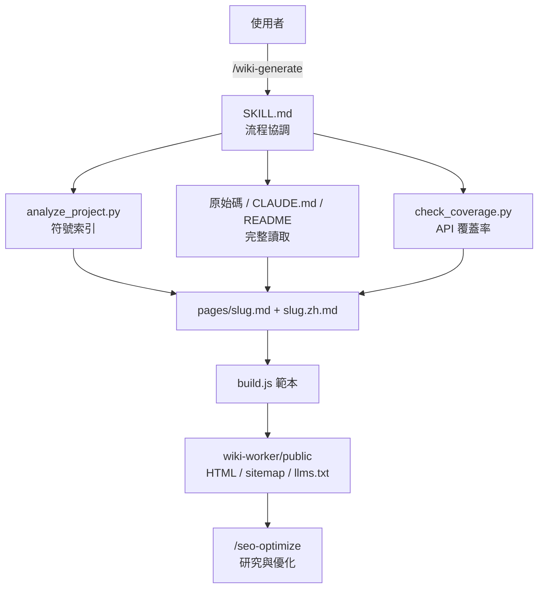

> [!NOTE]
> 此 README 由 [SKILL](https://github.com/agenvoy/skill-readme-generate) 生成，英文版請參閱 [這裡](../README.md)。 
> 此 skill 的實作內容全由 agent 生成，開發者僅針對 input / output 進行調整。

***

<strong>BILINGUAL DOCS SITES AUTO-GENERATED FROM YOUR SOURCE!</strong>

***

> Agent Skill，具備雙語文件站生成、API 覆蓋率追蹤與 GitHub 版本紀錄

## 目錄

- [功能特點](#功能特點)
- [架構](#架構)
- [授權](#授權)

## 功能特點

> `/wiki-generate` · [完整文件](./doc.zh.md)

- **可部署的雙語文件站** — 每個主題產出英中成對 markdown，由隨附的 `build.js` 編譯為含側欄、目錄與 sitemap 的靜態 HTML，可直接部署到 Cloudflare Workers。
- **搭配 /seo-optimize 優化** — 範本內建 JSON-LD、hreflang、llms.txt 等 SEO 輸出，研究與優化交給 `/seo-optimize`，未安裝時詢問是否下載，否決則依基本規則完成。
- **API 覆蓋率與移除紀錄** — `check_coverage.py` 找出文件漏寫的公開符號，並沿 tag 標出每個已移除符號的移除版本。
- **完整讀檔才下筆** — analyzer 只當作「該讀哪些檔」的索引，每頁都要讀完對應原始碼與 `CLAUDE.md`，文件寫得出分支與邊界而不只是簽章。
- **首頁鏡像 README、版本取自 Release** — 首頁逐字鏡像專案 README，版本紀錄直接從 GitHub Releases 同步，兩者都不需另外手寫。

## 架構

> [完整架構](./architecture.zh.md)

## 授權

本專案採用 [MIT LICENSE](../LICENSE)。
