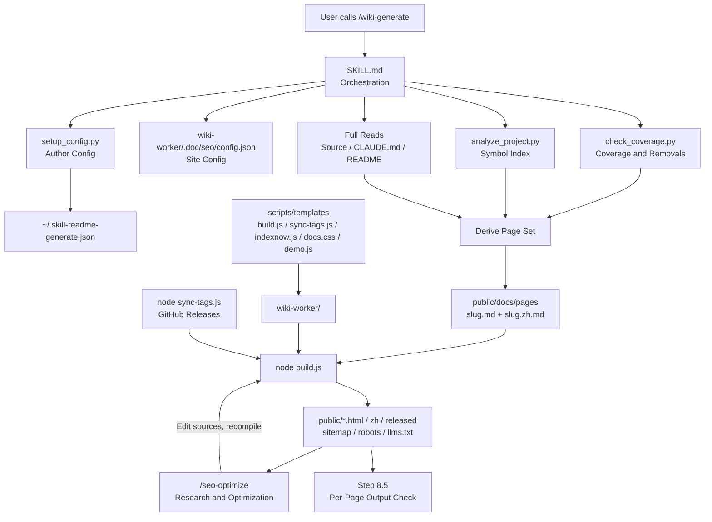
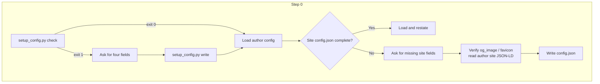
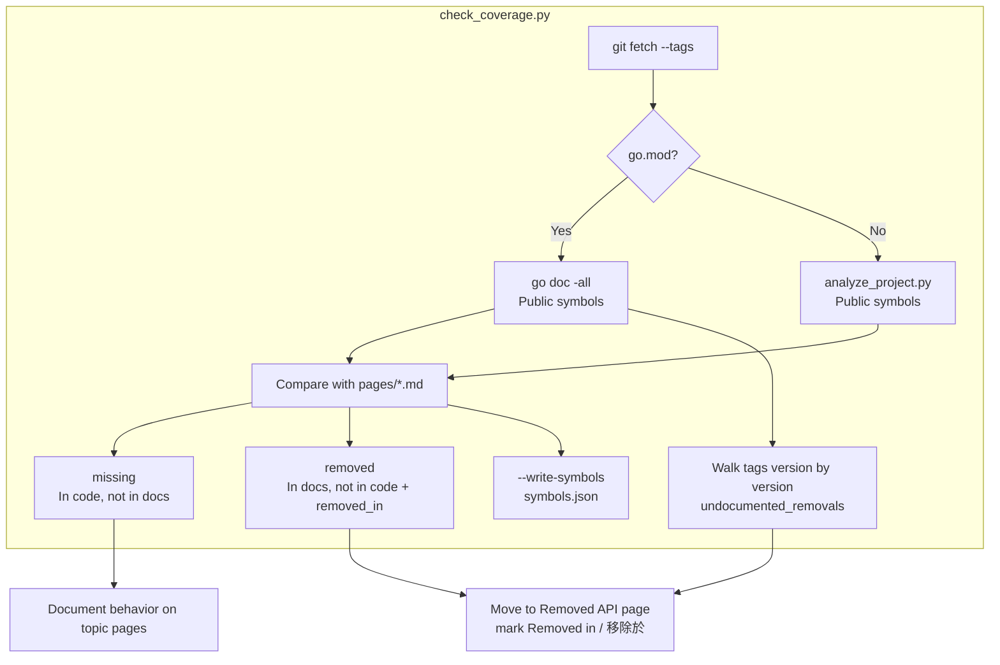
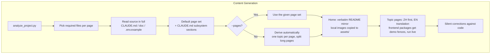
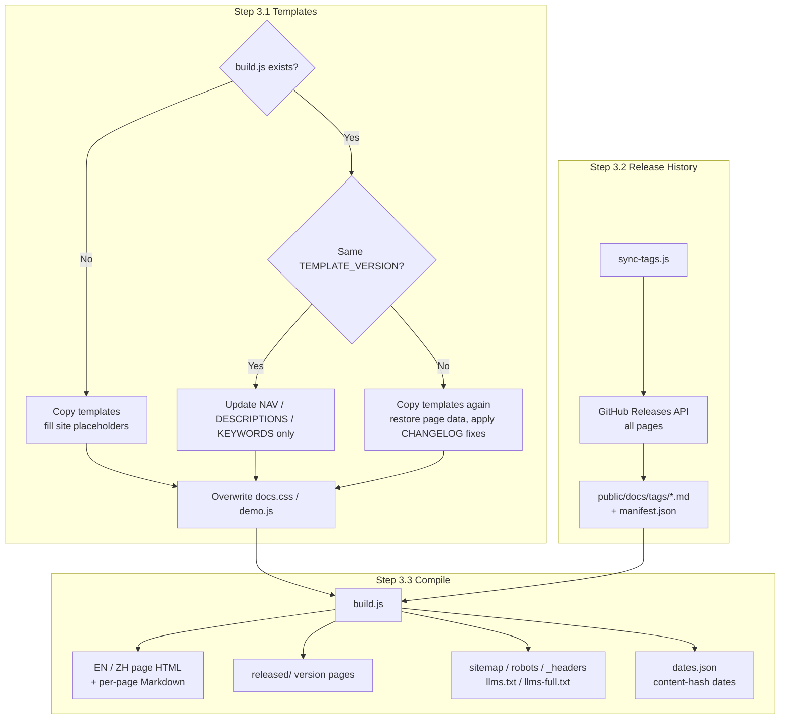
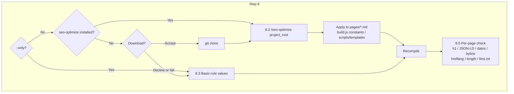
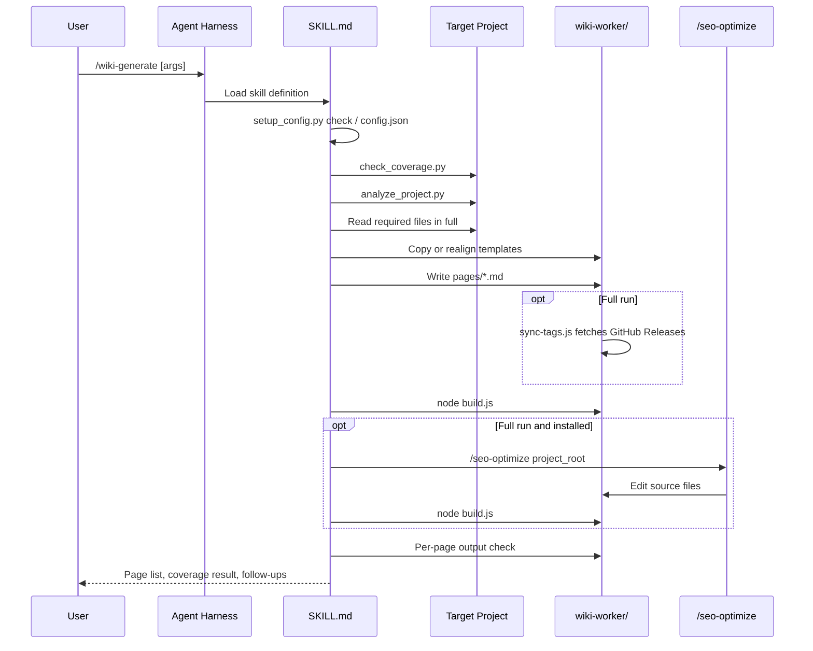
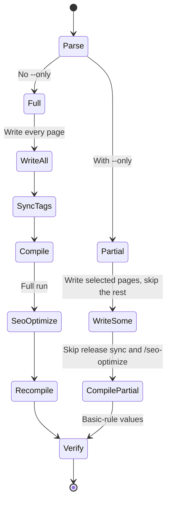

# wiki-generate - Architecture

> Back to [README](../README.md)

## Overview

## Module: SKILL.md (Orchestration)

Defines arguments, per-step rules, the verification checklist, and prohibitions; script and template paths use `{skill_dir}`, resolved to the actual load location.

```mermaid
graph TB
    subgraph Workflow[SKILL.md Workflow]
        W0[0 Author and site config] --> W05[0.5 Coverage check]
        W05 --> W1[1 Parse arguments]
        W1 --> W2[2 Symbol index]
        W2 --> W3[3 Full file reads]
        W3 --> W4[4 Derive pages]
        W4 --> W5[5 Copy or realign templates]
        W5 --> W6[6 Home mirrors README]
        W6 --> W7[7 Topic pages ZH → EN]
        W7 --> W8[8 Silent corrections]
        W8 --> W9[9 Sync releases]
        W9 --> W10[10 Compile]
        W10 --> W11[11 SEO: /seo-optimize or basic rules]
        W11 --> W12[12 Checklist]
    end
```

## Module: Configuration (Step 0)

## Module: Coverage (Step 1.4)

## Module: Content Generation (Steps 1, 2, 4, 5)

## Module: Templates and Compilation (Step 3)

## Module: SEO/AEO (Step 8)

## Data Flow

## `--only` State Machine

