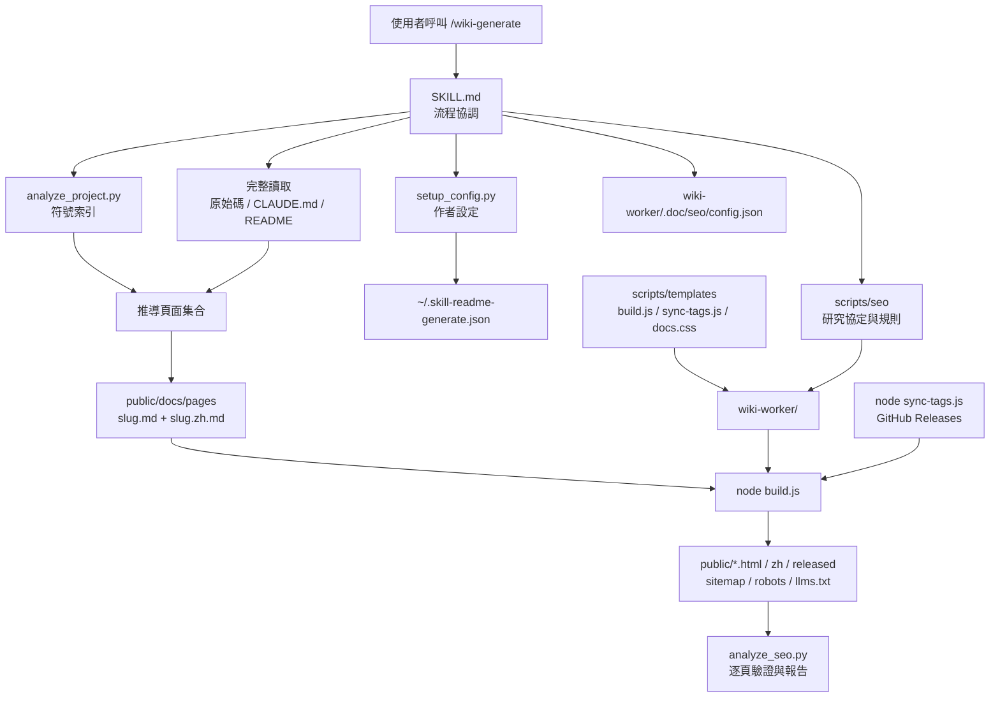
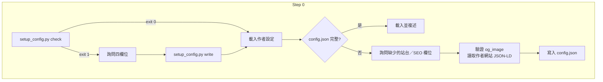
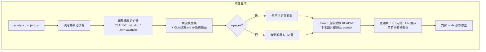
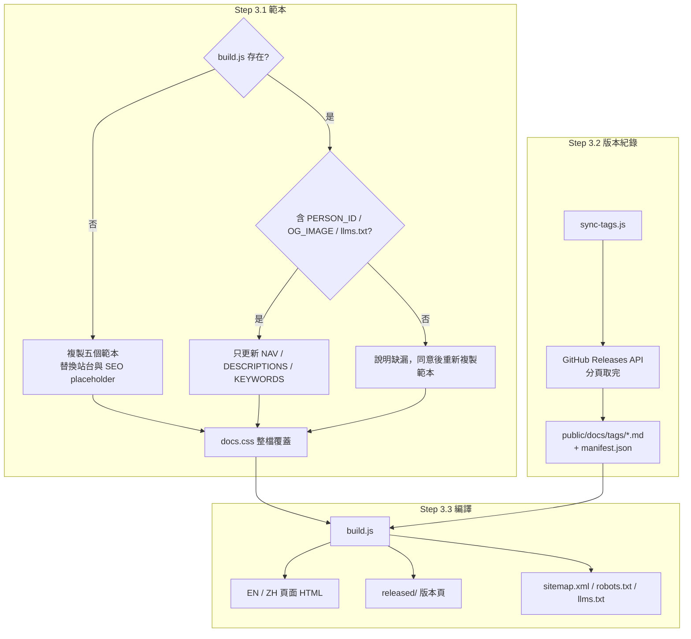
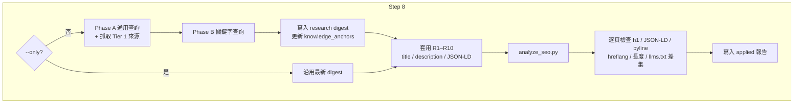
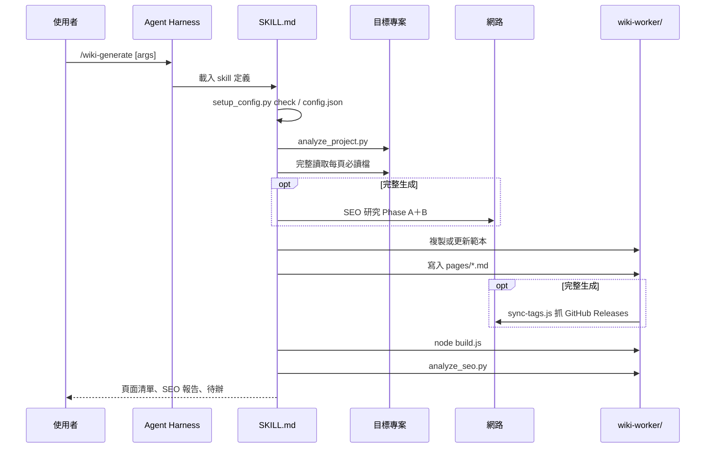
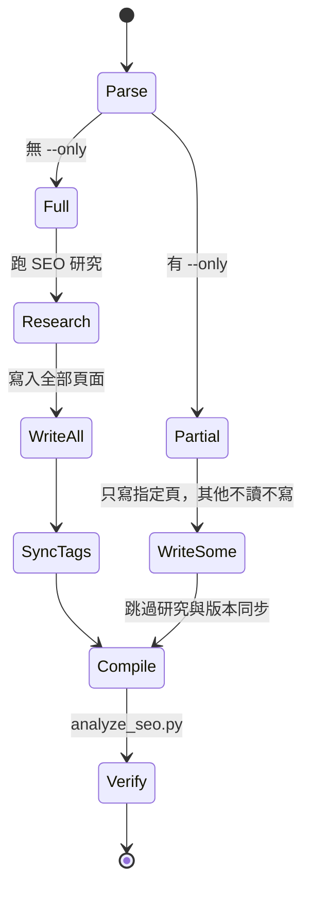

# wiki-generate - 架構

> 返回 [README](./README.zh.md)

## 概覽

## Module: SKILL.md（流程協調）

定義參數、各步驟規則、驗證清單與禁止行為；腳本與範本路徑以 `{skill_dir}` 表示，依實際載入位置代入。

```mermaid
graph TB
    subgraph Workflow[SKILL.md 工作流程]
        W0[0 作者與站台設定] --> W1[1 解析參數]
        W1 --> W2[2 符號索引]
        W2 --> W3[3 完整讀檔]
        W3 --> W4[4 SEO 研究]
        W4 --> W5[5 推導頁面]
        W5 --> W6[6 首次生成複製範本]
        W6 --> W7[7 Home 鏡像 README]
        W7 --> W8[8 主題頁 ZH → EN]
        W8 --> W9[9 靜默修正]
        W9 --> W10[10 同步版本]
        W10 --> W11[11 編譯]
        W11 --> W12[12 SEO 驗證]
        W12 --> W13[13 檢查清單]
    end
```

## Module: 設定（Step 0）

## Module: 內容生成（Step 1、2、4、5）

## Module: 範本與編譯（Step 3）

## Module: SEO／AEO（Step 8）

## 資料流

## `--only` 狀態機

